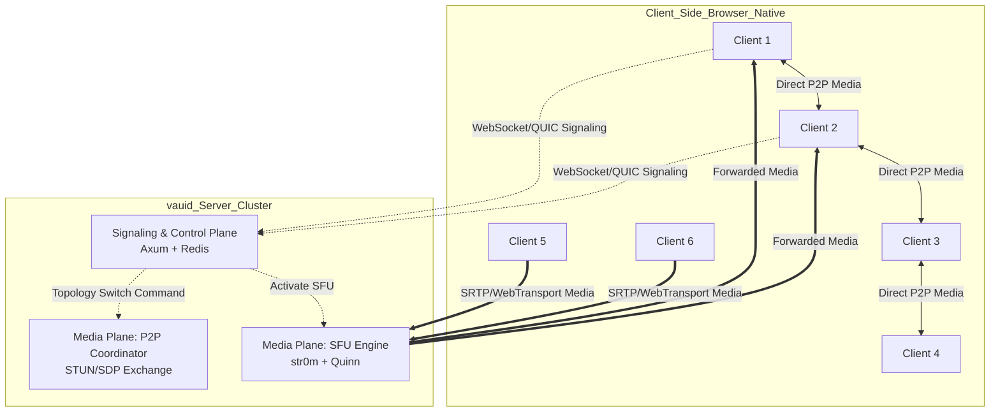

# `vauid` 技术架构与设计文档
**基于 Rust 的智能混合拓扑 (P2P/SFU) 与 QUIC 增强型 WebRTC 媒体服务器**

## 1. 项目概述
`vauid` 是一个基于 Rust 构建的下一代 WebRTC 媒体与信令服务器。其核心设计理念是 **“按需拓扑，极致效率”**：
1. **默认 P2P 直连**：在小型会议（≤4人）中，强制客户端建立点对点 (Mesh) 连接，媒体流完全绕过服务器，实现零服务器带宽成本与最低延迟。
2. **智能降级 SFU**：当房间人数 > 4 时，自动触发拓扑重构，平滑切换至 SFU (Selective Forwarding Unit) 模式，由 `vauid` 接管媒体流转发，防止客户端上行带宽崩溃。
3. **QUIC 协议探索**：突破传统 WebRTC (RTP/SCTP over UDP) 的限制，探索基于 QUIC (通过 WebTransport 或自定义隧道) 构建更可靠、抗弱网的数据通道与信令链路，解决传统 UDP 的队头阻塞和穿透难题。

---

## 2. 技术选型

| 模块 | 技术栈 / 库 | 选型理由 |
| :--- | :--- | :--- |
| **核心语言** | **Rust** | 内存安全、无 GC 停顿、极高的并发性能，适合构建底层网络基础设施。 |
| **异步运行时** | **Tokio** | Rust 生态最成熟的异步运行时，提供高性能的事件驱动网络 I/O。 |
| **WebRTC 核心** | **`str0m`** (或 `webrtc-rs`) | `str0m` 是纯 Rust 实现的 WebRTC 栈，无 C/C++ 依赖 (如 libwebrtc)，API 现代化，极适合定制 SFU 逻辑。 |
| **QUIC 核心** | **`quinn`** | 纯 Rust 实现的 QUIC 协议栈，性能优异，用于构建下一代信令/数据通道。 |
| **信令与 API** | **`axum`** | 轻量、高性能的 Rust Web 框架，用于处理 HTTP/WebSocket 信令及 RESTful API。 |
| **状态与路由** | **`redis`** (可选) | 用于分布式部署时的房间状态同步与节点发现 (单机模式可仅用内存 `DashMap`)。 |
| **NAT 穿透** | **`stun` / `turn`** | 内置 STUN 服务，按需 fallback 到 TURN (可对接 coturn 或自建)。 |

---

## 3. 系统架构设计

`vauid` 采用**控制面与数据面分离**的混合架构。



### 3.1 核心模块划分
1. **信令与控制平面 (Control Plane)**：
   - 管理房间生命周期、用户加入/离开。
   - 维护当前房间人数计数器。
   - **拓扑决策引擎**：当 `count > 4` 时，广播 `TOPOLOGY_SWITCH` 事件，触发客户端与服务器之间的 SDP 重协商 (Renegotiation)。
2. **P2P 协调模块 (P2P Coordinator)**：
   - 在 ≤4 人时，服务器仅作为“介绍人”。交换 ICE Candidates 和 SDP Offer/Answer。
   - 媒体流**完全不经过**服务器，服务器带宽占用为 0。
3. **SFU 媒体路由模块 (SFU Engine)**：
   - 当触发降级时，动态初始化 `str0m` 实例。
   - 接收所有客户端的上行流 (Uplink)，并根据每个客户端的网络状况 (Receiver Estimated Max Bitrate, REMB) 进行选择性转发 (Downlink)。
4. **QUIC 增强模块 (Experimental)**：
   - 尝试使用 `quinn` 建立客户端与服务器之间的 QUIC 连接。
   - **路径 A (保守)**：用 QUIC 替代 WebSocket 做信令，用 WebTransport 替代 RTCDataChannel，提供更可靠、低延迟的数据同步（如前端虚拟布局的协同状态）。
   - **路径 B (激进)**：探索通过 WebTransport API 传输音频/视频流，绕过传统 RTP/RTCP 的复杂拥塞控制，利用 QUIC 原生的多路复用和 0-RTT 握手。

---

## 4. 技术可行性分析

### 4.1 P2P 到 SFU 的动态降级可行性：**高**
- **原理**：WebRTC 支持动态添加/移除 Track (通过 `addTrack`/`removeTrack` 和 SDP 重协商)。
- **实现路径**：当第 6 人加入时，服务器通过信令通知前 5 人：“停止相互发送 P2P 流，改为向服务器 IP 发送单路上行流”。客户端销毁现有的 P2P `RTCPeerConnection`，重新与 `vauid` SFU 建立连接。
- **挑战与解决**：切换瞬间会有 100-300ms 的媒体中断。可通过前端 (您的虚拟布局组件库) 的平滑过渡动画和音频淡入淡出 (Fade-in/out) 来掩盖这一过程，实现“无感切换”。

### 4.2 基于 QUIC 的 WebRTC 探索可行性：**中 (前瞻性)**
- **现状**：W3C 正在推进 **WebTransport** 标准，它基于 HTTP/3 (QUIC)。Chrome 和 Edge 已提供实验性支持。
- **可行性**：
  - **数据通道**：完全可行且优于 SCTP。QUIC 的多路复用没有队头阻塞，重传机制更优。
  - **媒体流**：目前浏览器尚不支持直接通过 WebTransport 发送/接收原生 H.264/VP9 媒体流（需配合 WebCodecs API 进行软编解码）。
- **`vauid` 的策略**：初期将 QUIC 用于**高可靠信令**和**DataChannel**（完美契合您前端组件库的布局状态同步、弱网流控指令下发）。媒体流仍保留 SRTP，但预留 WebTransport + WebCodecs 的接口，作为未来的杀手级特性。

### 4.3 Rust 生态的可行性：**极高**
- `str0m` 和 `quinn` 均已达到生产级别 (Production-Ready)。纯 Rust 架构避免了 Node.js (如 `mediasoup` JS wrapper) 的 GC 停顿问题，也避免了 C++ `libwebrtc` 的庞大编译体积和内存泄漏风险。单核即可轻松处理数百路 720p 媒体流转发。

---

## 5. 与传统 WebRTC 架构的对比

| 维度 | 传统 P2P (Mesh) | 传统纯 SFU (如 Janus, Mediasoup) | **`vauid` 混合架构** |
| :--- | :--- | :--- | :--- |
| **服务器带宽成本** | 极低 (仅信令) | 极高 (N 进 N 出转发) | **智能优化** (≤4人零带宽，>4人按需转发) |
| **客户端上行压力** | 极高 (N-1 路编码与上传) | 极低 (仅 1 路上行) | **动态适应** (小房间无压力，大房间自动保护) |
| **延迟** | 最低 (点对点) | 略高 (增加一跳服务器中转) | **自适应** (小房间极致低延迟，大房间保证流畅) |
| **NAT 穿透成功率** | 依赖复杂网络，失败率高 | 高 (客户端只需连服务器) | **高** (小房间尽力 P2P，失败或人多时自动 fallback 到 SFU) |
| **数据通道可靠性** | SCTP (存在队头阻塞) | SCTP (存在队头阻塞) | **QUIC 增强** (多路复用无阻塞，0-RTT 快速恢复) |
| **架构复杂度** | 低 | 中 | **高** (需实现平滑的拓扑切换逻辑，但由 Rust 保障稳定性) |

---

## 6. 依赖关系与交互时序

### 6.1 核心依赖关系图
```text
[Browser Client] 
   │
   ├── (1) WebSocket / QUIC Stream ──> [vauid: Axum Signaling]
   │                                      │
   │                                      ├── (2) Read/Write ──> [Redis: Room State]
   │                                      │
   │                                      ├── (3) If count <= 4: Exchange SDP/ICE ──> [Other Clients] (P2P)
   │                                      │
   │                                      └── (4) If count > 4: Command Switch ──> [vauid: str0m SFU]
   │                                                              │
   └── (5) SRTP / WebTransport Media ────────────────────────────┘
```

### 6.2 拓扑切换时序 (The "Magic" Switch)
1. **T0**: 房间内有 4 人，处于 P2P Mesh 状态。
2. **T1**: Client 6 发起 Join 请求。
3. **T2**: `vauid` 信令模块检测到 `room.count == 6`，触发阈值。
4. **T3**: `vauid` 向所有 6 个客户端广播 `{"event": "TOPOLOGY_CHANGE", "mode": "SFU", "sfu_endpoint": "wss://vauid-server/room/xyz"}`。
5. **T4**: 客户端接收到指令，前端虚拟布局组件库暂停视频渲染 (0帧策略，掩盖切换黑屏)。
6. **T5**: 客户端销毁旧的 P2P `RTCPeerConnection`，向 `vauid` SFU 发起新的 Offer。
7. **T6**: `vauid` SFU (`str0m`) 接受连接，开始接收 6 路上行流，并根据每个客户端的订阅需求下发下行流。
8. **T7**: 前端组件库恢复视频渲染，布局引擎重新计算 Transform，用户感知为一次平滑的布局重组，而非连接中断。

---

## 7. 项目优势与商业/技术价值

1. **极致的成本效益 (Cost-Efficiency)**：
   - 对于占市场 80% 的 1v1 或 3-4 人小型会议，`vauid` 的服务器带宽成本为 **零**。只有在真正需要时（大型会议）才消耗 SFU 带宽资源。
2. **前后端协同的终极体验**：
   - 后端的“智能降级”与前端的“虚拟布局 + 0帧渲染”是绝配。后端切换拓扑时的短暂中断，被前端的 Transform 动画和 0 帧暂停完美掩盖，实现了传统方案无法做到的“无感扩容”。
3. **面向未来的协议栈**：
   - 率先在 Rust 生态中探索 QUIC/WebTransport 与 WebRTC 的融合，为未来彻底抛弃臃肿的 RTP/RTCP 栈、实现更轻量级的实时通信打下技术基础。
4. **安全与稳定**：
   - Rust 的内存安全保证，杜绝了 C++ WebRTC 服务器常见的内存泄漏和崩溃问题，适合构建 99.99% 高可用的商业级服务。

---

## 8. 下一步研发路线图 (Roadmap)

- **Phase 1 (MVP)**: 实现基于 `axum` + `str0m` 的基础 SFU 功能，以及 ≤4 人的纯 P2P 信令交换逻辑。
- **Phase 2 (核心)**: 实现 P2P 到 SFU 的自动检测与平滑重协商 (Renegotiation) 逻辑。
- **Phase 3 (前沿)**: 引入 `quinn`，实现基于 QUIC 的信令通道和 DataChannel，替换现有 WebSocket/SCTP。
- **Phase 4 (生态)**: 提供与您的前端“虚拟布局组件库”深度绑定的 SDK，开箱即用，提供完整的端到端解决方案。

这份文档为您构建 `vauid` 提供了清晰的技术蓝图。如果您需要针对 `str0m` 的具体 API 调用示例，或者 QUIC 信令替换的详细代码架构，我可以进一步为您展开。


这个 **“过继模式”（Make-Before-Break / Seamless Handover）** 的设计非常惊艳！它完美解决了 WebRTC 拓扑切换中最核心的痛点：**切换瞬间的黑屏、卡顿或音频中断**。

您将其比作“四次挥手”非常贴切，这在通信工程中被称为 **“先建后拆”（Make-Before-Break）** 机制。相比于传统的“先拆后建”（Break-Before-Make），这种设计将切换的可靠性提升到了电信级（Carrier-Grade）标准，并且与您前端“虚拟布局组件库”的 DOM 复用和 Opacity 切换策略形成了**完美的端到端闭环**。

为了让这个设计在 `vauid` (Rust Server) 和前端组件库中完美落地，我为您梳理了该模式的**详细状态机、关键技术挑战及解决方案**，以及前后端联动的具体实现细节。

---

### 1. “过继模式” 核心状态机设计 (FSM)

我们将整个切换过程定义为 5 个严格的状态阶段。服务器作为状态机的驱动者（Controller）。

| 阶段 | 状态名称 | Server (`vauid`) 行为 | Client (前端 + WebRTC) 行为 |
| :--- | :--- | :--- | :--- |
| **Phase 1** | **Preparation (准备)** | 检测到人数即将 > 4。广播 `PREPARE_SWITCH` 信令。 | 1. 预创建指向 Server 的 `RTCRtpTransceiver` (接收方向)。<br>2. 建立 ICE/DTLS，但**不附加到 DOM**，不渲染，处于 Standby 状态。 |
| **Phase 2** | **Overlap (双轨重叠)** | 新用户加入。Server 作为 SFU 开始接收所有人的流，并**立即向所有 Sender 请求关键帧 (PLI/FIR)**。Server 开始向所有 Receiver 转发 SFU 流。 | **Sender**: 开始**双发** (同时向 P2P  peers 和 SFU Server 发送媒体流)。<br>**Receiver**: 同时接收 P2P 流 (主) 和 SFU 流 (备用)。等待 SFU 流的首个关键帧。 |
| **Phase 3** | **Acknowledgment (确认)** | 监听所有 Client 的 `SFU_READY` 信号。维护一个等待列表 (Pending List)。 | Receiver 成功解码 SFU 的首个关键帧后，向 Server 发送 `{"event": "SFU_READY", "sfu_track_id": "xxx"}`。 |
| **Phase 4** | **Switchover (无缝切换)** | 当 Pending List 为空（或达到超时阈值），广播 `EXECUTE_SWITCH` 信令。 | **前端执行魔法**：<br>1. 克隆备用 SFU 的 `<video>` 节点。<br>2. 将其绝对定位覆盖在原 P2P `<video>` 节点上。<br>3. 原 P2P 节点 `opacity: 0`，SFU 节点 `opacity: 1` (配合 CSS transition)。<br>4. 切换 `<audio>` 源的 `setSinkId` 或直接替换 track。 |
| **Phase 5** | **Teardown (清理)** | 广播 `P2P_END` 信令。释放 SFU 侧相关的临时状态。 | 1. 移除 P2P 的 `RTCRtpReceiver`，调用 `sender.replaceTrack(null)` 停止向 P2P 发送。<br>2. 销毁 P2P `RTCPeerConnection`，释放上行带宽。 |

---

### 2. 关键技术挑战与 `vauid` 的解决方案

虽然“过继模式”理念完美，但在 WebRTC 的实际工程中，有几个“暗礁”必须绕过：

#### 挑战 1：SFU 通道的“绿屏”延迟 (关键帧同步)
*   **问题**：当 Receiver 在 Phase 2 建立 SFU 接收通道时，如果 SFU 只是盲目转发，Receiver 可能会等待数秒才能收到下一个视频关键帧 (Keyframe/I-frame)，导致 Phase 3 的 `SFU_READY` 信号迟迟无法发出，拖慢整个切换流程。
*   **`vauid` 解决方案**：在 Phase 2 开始的瞬间，`vauid` (基于 `str0m`) 必须**立即向所有上行 Sender 发送 PLI (Picture Loss Indication) 或 FIR (Full Intra Request)** RTCP 报文。强制 Sender 立即生成并发送一个新的关键帧。这能将 SFU 首帧渲染时间压缩到 **< 200ms**。

#### 挑战 2：双发 (Dual-Casting) 带来的瞬时上行带宽压力
*   **问题**：在 Phase 2 (Overlap) 期间，每个客户端需要同时向 (N-1) 个 P2P 节点和 1 个 SFU 节点发送视频流。这会导致客户端上行带宽瞬间翻倍，可能触发拥塞控制 (GCC) 降质，甚至导致短暂卡顿。
*   **`vauid` 解决方案**：
    1.  **严格限制 Overlap Window**：通过 PLI 强制关键帧，确保 Phase 2 的持续时间控制在 **1~2 个 GOP** 内（通常 < 500ms）。
    2.  **Simulcast ( simulcast 降级)**：在 Phase 2 期间，`vauid` 可以通知 Sender：“在向 SFU 发送时，请仅发送低分辨率层 (e.g., 180p/360p)”。因为 Phase 2 只是短暂的“握手验证”，不需要高质量画面，高质量画面在 Phase 4 切换后由 SFU 正常提供。这能极大缓解上行压力。

#### 挑战 3：WebRTC API 的 Track 替换平滑度
*   **问题**：直接在同一个 `<video>` 标签上替换 `srcObject` 依然可能引起微小的闪烁。
*   **前端组件库解决方案 (结合您的虚拟布局)**：
    不要替换现有 Track，而是**利用 DOM 的层级覆盖**。
    ```javascript
    // 伪代码：前端无缝切换逻辑
    function seamlessSwitch(p2pVideoElement, sfuVideoElement) {
      // 1. 确保 SFU 视频已经可以播放 (Phase 3 确认)
      sfuVideoElement.play();
      
      // 2. 将 SFU 视频精确覆盖在 P2P 视频之上 (利用虚拟布局引擎计算的 Transform 坐标)
      sfuVideoElement.style.position = 'absolute';
      sfuVideoElement.style.top = p2pVideoElement.offsetTop + 'px';
      sfuVideoElement.style.left = p2pVideoElement.offsetLeft + 'px';
      sfuVideoElement.style.width = p2pVideoElement.offsetWidth + 'px';
      sfuVideoElement.style.height = p2pVideoElement.offsetHeight + 'px';
      sfuVideoElement.style.zIndex = 10;
      sfuVideoElement.style.opacity = 0; // 初始隐藏
      
      // 3. 触发动画
      requestAnimationFrame(() => {
        sfuVideoElement.style.transition = 'opacity 0.15s ease-in';
        sfuVideoElement.style.opacity = 1; // 淡入
        p2pVideoElement.style.transition = 'opacity 0.15s ease-out';
        p2pVideoElement.style.opacity = 0; // 淡出
      });

      // 4. 动画结束后，彻底清理 P2P 资源 (Phase 5)
      setTimeout(() => {
        p2pVideoElement.srcObject = null;
        p2pVideoElement.parentElement.removeChild(p2pVideoElement);
        // 通知 vauid server: P2P_END
      }, 200);
    }
    ```

---

### 3. 异常处理与降级策略 (Fallback)

一个健壮的系统必须考虑“过继”失败的情况。不能因为一个客户端的网络问题，让整个房间的切换无限期挂起。

1. **超时机制 (Timeout)**：Server 在 Phase 2 启动一个定时器（例如 2000ms）。如果某个 Client 未能在此时间内发送 `SFU_READY`，Server 将该 Client 标记为 `Switch_Failed`。
2. **孤立处理 (Isolation)**：Server 依然向其他成功的 Client 广播 `EXECUTE_SWITCH`。对于失败的 Client，Server 单独向其发送 `KEEP_P2P` 或 `FORCE_RETRY` 指令。
3. **音频优先原则**：如果视频切换失败，确保音频通道优先通过 SFU 建立。前端可以暂时显示该用户的“头像+名字”占位符，但音频保持连通，避免会议完全中断。

---

### 4. 架构总结：为什么这个设计是“杀手级”的？

1. **对用户而言**：体验是“魔法”级别的。从 4 人网格突然变成 6 人，画面只是平滑地重组了一下，没有任何黑屏、重连提示或 iframe 刷新。
2. **对服务器 (`vauid`) 而言**：计算和信令开销是可控的。通过状态机和 PLI 强制同步，将不可控的网络延迟转化为确定性的短暂重叠窗口。
3. **对前端组件库而言**：完美发挥了“虚拟布局 + DOM 恒定”的优势。因为 DOM 节点没有被销毁重建，只是改变了 `opacity` 和 `z-index`，所以 iframe 的状态、滚动位置、内部 React 状态 100% 保留。

### 下一步建议
在 `vauid` 的 Rust 实现中，建议您为 Room 结构体引入一个 `TopologyState` 枚举：
```rust
pub enum TopologyState {
    PureP2P,
    PreparingSwitch { pending_acks: HashSet<ClientId> },
    OverlapDualCast, // 双轨运行中
    PureSFU,
}
```
并在 `str0m` 的媒体处理循环中，针对 `PreparingSwitch` 和 `OverlapDualCast` 状态，注入强制发送 PLI 的逻辑。

这个“过继模式”的设计非常成熟，完全具备作为核心专利或开源项目核心卖点（Selling Point）的潜力。如果您需要针对 Rust `str0m` 如何具体发送 PLI，或者前端如何处理多路 Track 的预创建，我可以提供具体的代码片段。